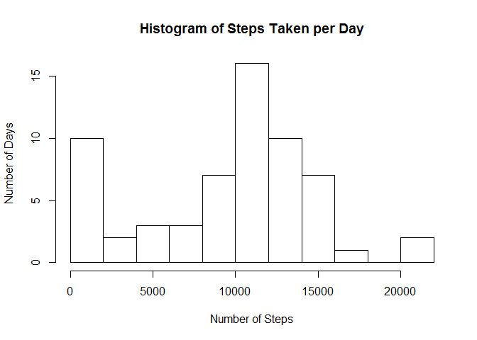
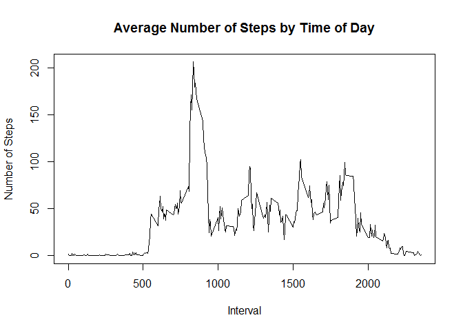
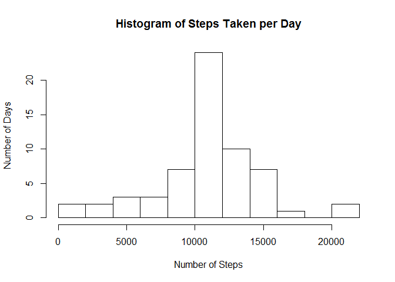
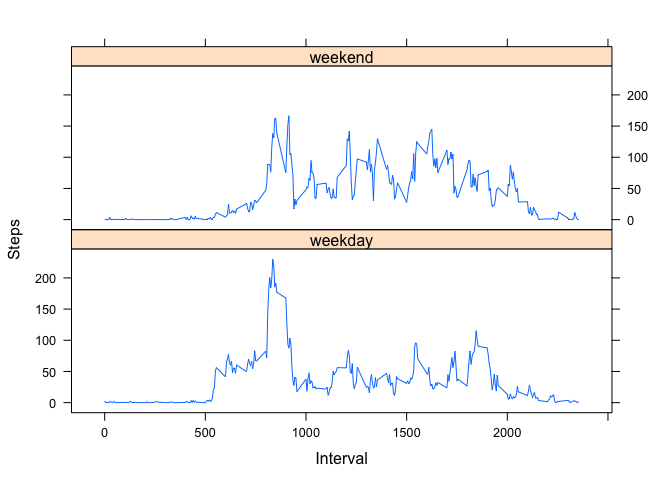

# Reproducible Research: Peer Assessment 1
Nehemiah Loury  
October 12, 2015  


### Introduction

In this document, I will investigate some data taken from a personal activity monitoring device over a two month period in order to glean insight about the user's activity.


### Loading and preprocessing the data and necessary packages

Before beginning analysis on said data, I first need to load it into R along with the packages I will be using for analysis.


```r
## Load necessary packages
library(lattice)
library(reshape2)

## Download the data
download.file("http://d396qusza40orc.cloudfront.net/repdata%2Fdata%2Factivity.zip", "RRPeerAssessment1Data.zip")
unzip("RRPeerAssessment1Data.zip")

## Read data into R
activitydata <- read.csv("activity.csv", stringsAsFactors = FALSE)
```

We also need to add a couple of variables, *minutes* and *datetime*, to the dataset in order to make analysis down the road easier.


```r
## Add minutes variable
minutes <- seq(0,1435, by = 5)
activitydata$minutes <- rep(minutes,61)

## Add datetime variable
activitydata$datetime <- with(activitydata, as.POSIXlt(minutes*60, origin = as.Date(date), tz = "UTC"))
```


### What is the total number of steps taken per day?

Now that the data is ready for analysis, I'll first calculate at the total number of steps taken per day. The histogram below gives a nice picture of the distribution of steps taken per day:


```r
## Calculate Total Steps Taken Per Day
totalsteps <- tapply(activitydata$steps, activitydata$date, sum, na.rm = TRUE)
hist(totalsteps, xlab = "Number of Steps", ylab = "Number of Days", main = "Histogram of Steps Taken per Day", breaks = 10)
```

 

I can also calculate the mean and median steps taken per day.


```r
## Calculate Mean and Median of Total Steps Taken Per Day
mean(totalsteps)
```

```
## [1] 9354.23
```

```r
median(totalsteps)
```

```
## [1] 10395
```


### What is the average daily activity pattern?

By creating a time-series plot, I can discover how activity has varied on average across each 5 minute interval for the two months that the data has been collected.


```r
## Calculate Daily Activity Pattern
intervalsteps <- tapply(activitydata$steps, activitydata$interval, mean, na.rm = TRUE)
plot(unique(activitydata$interval),intervalsteps, type = "l", xlab = "Interval", ylab = "Number of Steps", main = "Average Number of Steps by Time of Day")
```

 

I can also take a look to see which interval has, on average, the maximum number of steps.


```r
maxinterval <- as.numeric(names(which(intervalsteps == max(intervalsteps))))
maxinterval
```

```
## [1] 835
```


### Imputing missing values
There are a number of days/intervals with missing values in the dataset. The presence of this missing information may introduce bias into some calculations or summaries of the data.


```r
## Find Total Number of Missing Values in the Dataset
sum(is.na(activitydata))
```

```
## [1] 2304
```

I see that there are 2304 missing values. I can fill in those missing values using the mean for the associated 5 minute interval averaged across all days to attempt to remove the missing value bias from the data. I'll create a new dataset, *activitydatanew*, to that end.


```r
## Create New Dataset with Missing Values Filled in
activitydatanew <- activitydata
for (i in 1:length(activitydatanew$steps)) {
  if (is.na(activitydatanew[i,"steps"])) {
    iinterval <- activitydatanew[i,"interval"]
    activitydatanew[i,"steps"] <- intervalsteps[as.character(iinterval)]
  }
}
```

I'll now recreate the histogram of steps taken per day to see how filling in these missing values has affected the distribution of the data.


```r
## Calculate Total Steps Taken Per Day on New Dataset
totalstepsnew <- tapply(activitydatanew$steps, activitydatanew$date, sum, na.rm = TRUE)
hist(totalstepsnew, xlab = "Number of Steps", ylab = "Number of Days", main = "Histogram of Steps Taken per Day", breaks = 10)
```

 

I can also take a look to see how the mean and median have changed.


```r
## Calculate Mean and Median Differences from the Original Dataset
meandifference <- mean(totalstepsnew) - mean(totalsteps)
meandifference
```

```
## [1] 1411.959
```

```r
mediandifference <- median(totalstepsnew) - median(totalsteps)
mediandifference
```

```
## [1] 371.1887
```
It seems like filling in these values has caused the mean to increase by 1411.959171, but that the median has remained the same. Generally, by looking at the two histograms, I can see that a large number of days that previously had very few steps have now been shifted towards the center of the distribution.


### Are there differences in activity patterns between weekdays and weekends?

In order to investigate the differences between weekdays and the weekend, I'll create a factor variable, *typeofday*, that indicates whether a given date is a weekeday or on the weekend


```r
## Create day and typeofday variables
activitydatanew$day <-weekdays(activitydatanew$datetime)
activitydatanew$typeofday <- NA
for(i in 1:nrow(activitydatanew)) {
  if(activitydatanew$day[i] == "Saturday" | activitydatanew$day[i] == "Sunday"){
    activitydatanew$typeofday[i] <- "weekend"
  } else {
    activitydatanew$typeofday[i] <- "weekday"
  }
}
activitydatanew$typeofday <- factor(activitydatanew$typeofday, ordered = FALSE)
```

I can now create a time series plot of the 5-minute interval and the average number of steps taken, averaged across all weekday days or weekend days. I'll first create  a new dataset, *intervalstepnew*, that will allow me to generate the plot.


```r
## Calculate New Daily Activity Pattern
intervalstepsnew <- with(activitydatanew, tapply(steps, list(interval,typeofday), mean))

## Reshape Daily Activity Pattern Data
intervalstepsnew <- data.frame(intervalstepsnew)
intervalstepsnew$id <- rownames(intervalstepsnew)
intervalstepslong <- melt(intervalstepsnew)
```

```
## Using id as id variables
```

```r
intervalstepslong$id <- as.numeric(intervalstepslong$id)

## Plot New Daily Activity Pattern
xyplot(value ~ id | variable, data = intervalstepslong, type = "l", xlab = "Interval", ylab = "Steps", layout = c(1,2))
```

 

That's all folks!
